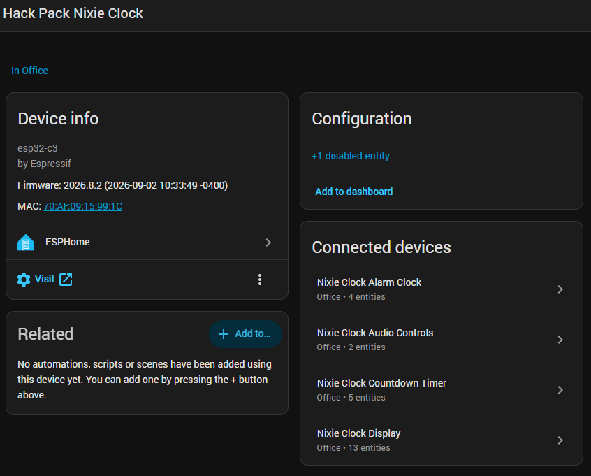
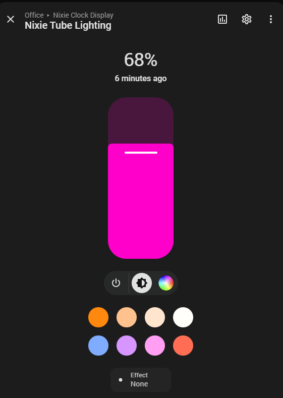
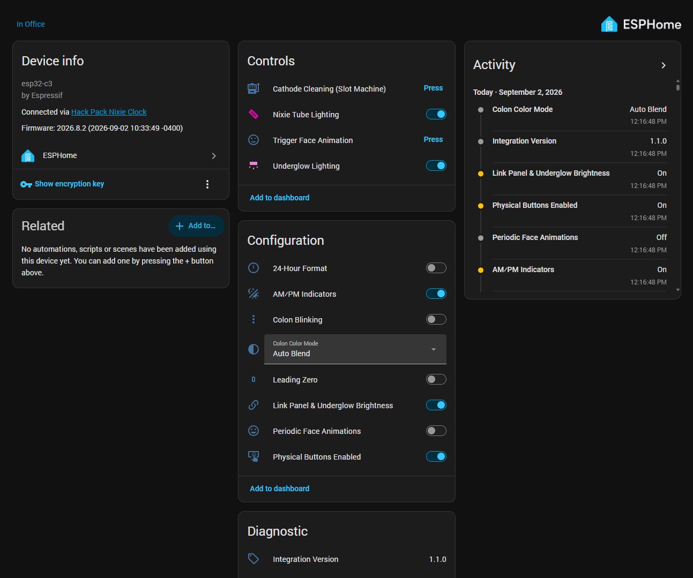
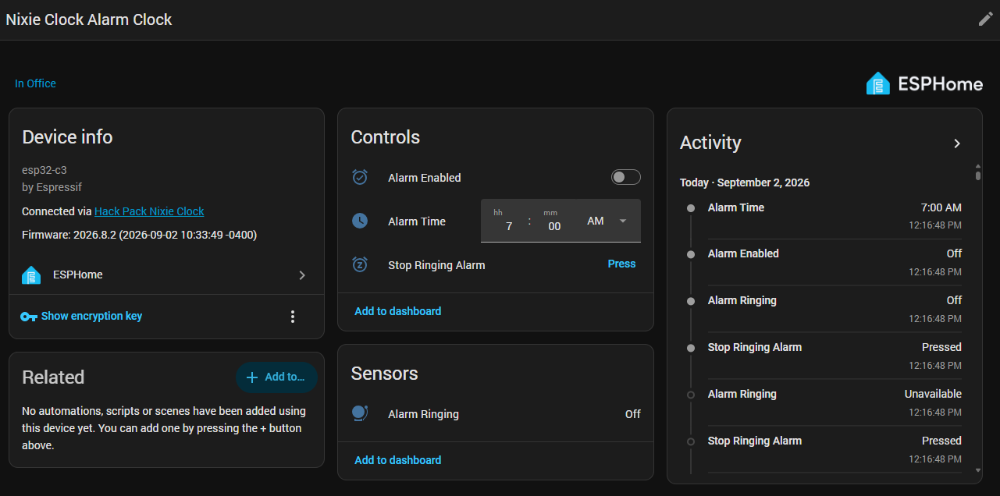
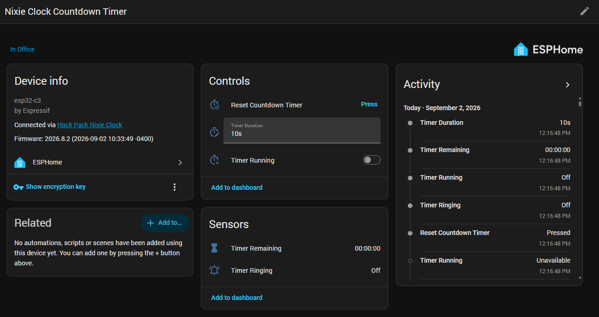
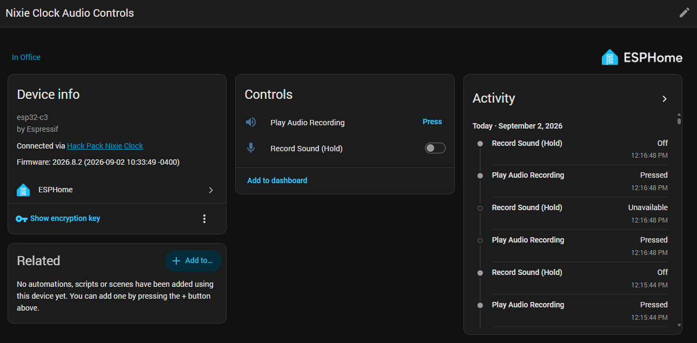
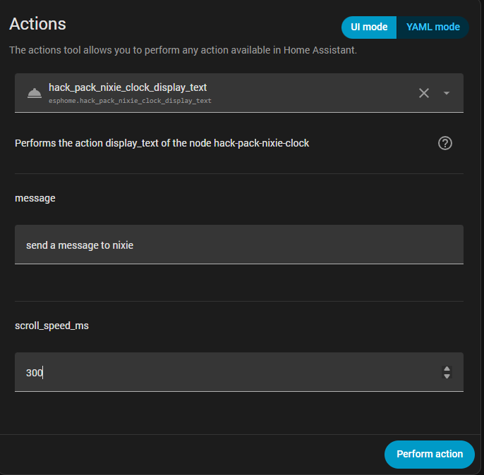

# Hack Pack Nixie Clock (Box 15) ESPHome Custom Component

[](https://esphome.io)
[](https://espressif.com)
[](https://esphome.io/components/esp32.html)
[](LICENSE)

An ESPHome custom component for the **CrunchLabs Hack Pack Box 15 (Smart Nixie Clock)** powered by the **ESP32-C3 Mini**. 

This integration provides a feature-complete **Home Assistant** integration while preserving and enhancing all animations, underglow effects, 7-segment character glyphs, timers, alarms, audio recording module controls, and physical button navigation.

<p align="center">
  
</p>

---

## ✨ Features

- 💾 **Non-Volatile Flash Persistence**: Restores all state, colors, brightness, format modes, alarms, button lock, and timer duration automatically across power cycles using ESPHome NVS Preferences.
- 🕒 **Native Time & Date Synchronization**: Automatically keeps accurate time synced from Home Assistant / NTP with 12-hour and 24-hour modes.
- 🎨 **Native RGB Color Pickers & Effects**: Full Home Assistant color wheel support for both the Nixie tube panel and underglow LEDs via native `light` entities with brightness sliders and built-in animation effects (**Rainbow**, **Gradient**, **Flow**, **Wipe**, **Pulse**, **Bounce**, **Solid**).
- 🔗 **Optical 80% Brightness Linking**: Synchronizes tube panel and underglow brightness levels using a calibrated 80% ratio to match lumens behind the acrylic darkening film.
- 💡 **Dynamic Underglow & Colons**: Underglow color control, AM/PM indicators, colon blinking, and automatic inter-panel color blending. Colons automatically turn completely off during message displays.
- ⏰ **Smart Alarm & Countdown Timers**: Native Home Assistant time-picker widget for alarm scheduling and natural language duration input (`"5m"`, `"1h 30m"`, `"45s"`) for countdown timers with live formatted `"HH:MM:SS"` sensors, physical button hold/repeat adjustments, and buzzer alerts.
- 🎙️ **Audio Recording & Playback**: Trigger recorded sound playback on demand or record new audio messages directly from Home Assistant.
- 🕹️ **Local Physical Buttons**: Full button debouncing, long-press actions, 100ms auto-repeat, and hardware navigation preserved, with the ability to lock/disable buttons from Home Assistant.
- 🚀 **Flicker-Free IRAM Driver**: Custom cycle-accurate WS2812 bit-banging engine running in internal RAM (`IRAM_ATTR`) with Perceptual Gamma 2.4 curve table, eliminating FreeRTOS/Wi-Fi single-core preemption and digit flickering.
- 💬 **Multi-Phase Alert & Scrolling Text Service**: Attention-grabbing message board sequence: 1s blank $\rightarrow$ 2s flashing `"- - - "` alert strobe $\rightarrow$ smooth right-to-left scrolling $\rightarrow$ 1s trailing blank $\rightarrow$ return to previous display mode.
- 🛡️ **OTA Brownout Protection**: Automatic LED blackout and Wi-Fi transmission power throttling (13 dBm) during Over-The-Air firmware updates to prevent voltage sags and boot loops.

<p align="center">
  
</p>

---

## 📁 Repository Structure

```text
hack-pack-nixie-clock/
├── assets/                            # Documentation screenshots & media
│   ├── ha_nixie-clock-device.png
│   ├── ha_lighting_controls.png
│   ├── ha_clock-display_subdevice.png
│   ├── ha_alarm-clock_subdevice.png
│   ├── ha_countdown-timer_subdevice.png
│   ├── ha_audio-controls_subdevice.png
│   └── ha_developer-tools_display-text.png
├── components/
│   └── hack_pack_nixie_clock/
│       ├── __init__.py                # Component schema, actions & setup
│       ├── types.h                    # Enums, structs & NVS storage schema
│       ├── font_map.h                 # 7-segment character lookup tables
│       ├── hardware_leds.h/.cpp       # WS2812 IRAM driver & Gamma 2.4 table
│       ├── light_output.h/.cpp        # RGB LightOutput, LightEffects & Listener
│       ├── entities.h/.cpp            # Switch, Button, Select, Text, Time entities
│       ├── automation.h               # ESPHome action template classes
│       ├── color_animations.h/.cpp       # Strategy pattern color engines
│       ├── hack_pack_nixie_clock.h
│       └── hack_pack_nixie_clock.cpp
├── packages/
│   ├── nixie_clock.yaml               # Drop-in package organized into 4 subdevices
│   └── nixie_clock_single_device.yaml # Drop-in package unified into a single device
├── examples/
│   ├── nixie_clock_basic.yaml         # Basic example using subdevices package
│   ├── nixie_clock_single_device.yaml # Basic example using single-device package
│   └── nixie_clock_advanced.yaml      # Advanced example with explicit entity overrides
└── README.md
```

---

## 🚀 Quickstart

Setting up your clock takes only a few lines of YAML. Choose between the **Subdevices Package** (organizes entities into 4 distinct functional devices in Home Assistant) or the **Single Device Package** (combines all entities into 1 unified device).

### Option 1: Remote GitHub Import (Recommended)

Add this directly to your ESPHome configuration on Home Assistant:

```yaml
# ==============================================================================
# Hack Pack Nixie Clock (Box 15)
# ==============================================================================
packages:
  # Choose one package:
  # A) Subdevices Package (4 functional devices):
  hack_pack_nixie_clock:
    url: https://github.com/ryanvidal/HackPack-NixieClock-ESPHome
    ref: hack_pack_nixie_clock-v1.1.0
    files: [packages/nixie_clock.yaml]

  # B) Single-Device Package (1 unified device):
  # hack_pack_nixie_clock:
  #   url: https://github.com/ryanvidal/HackPack-NixieClock-ESPHome
  #   ref: hack_pack_nixie_clock-v1.1.0
  #   files: [packages/nixie_clock_single_device.yaml]

external_components:
  - source: github://ryanvidal/HackPack-NixieClock-ESPHome@hack_pack_nixie_clock-v1.1.0
    components: [hack_pack_nixie_clock]

api:
  encryption:
    key: !secret api_encryption_key

wifi:
  ssid: !secret wifi_ssid
  password: !secret wifi_password
  ap:
    ssid: Hack Pack Nixie Fallback Hotspot

captive_portal:
```

### Option 2: Cloned Repository (Local Development)

If you clone this repository directly into your ESPHome directory:

```yaml
packages:
  hack_pack_nixie_clock: !include packages/nixie_clock.yaml

external_components:
  - source:
      type: local
      path: components
    components: [hack_pack_nixie_clock]

api:
  encryption:
    key: !secret api_encryption_key

wifi:
  ssid: !secret wifi_ssid
  password: !secret wifi_password
  ap:
    ssid: Hack Pack Nixie Fallback Hotspot

captive_portal:
```

---

## 🔌 Hardware Pin Mapping (Hack Pack Box 15 Defaults)

All pins default automatically to the CrunchLabs Hack Pack Box 15 hardware:

| Pin Name in YAML | Default GPIO | Function |
| :--- | :--- | :--- |
| `panel_pin` | `GPIO0` | 42 WS2812 LEDs (6 Nixie tubes × 7 segments) |
| `underglow_pin` | `GPIO1` | 13 WS2812 LEDs (2 Colons, 8 Badge, 1 Alarm, 1 AM, 1 PM) |
| `play_pin` | `GPIO5` | Voice module trigger output |
| `rec_pin` | `GPIO4` | Voice module record output |
| `btn_top_pin` | `GPIO19` | Top button (Snooze / Toggle Timer / Dismiss) (Active LOW) |
| `btn_center_pin` | `GPIO10` | D-pad Center button (Mode Cycle) (Active LOW) |
| `btn_up_pin` | `GPIO9` | D-pad Up button (Brightness / Value +) (Active LOW) |
| `btn_down_pin` | `GPIO8` | D-pad Down button (Brightness / Value -) (Active LOW) |
| `btn_left_pin` | `GPIO7` | D-pad Left button (Color / Adjust Left) (Active LOW) |
| `btn_right_pin` | `GPIO6` | D-pad Right button (Color / Adjust Right) (Active LOW) |

---

## 📱 Home Assistant Entities & Subdevices

When using `packages/nixie_clock.yaml`, entities are organized into **4 functional subdevices**:

### 1. 🖥️ Nixie Clock Display (`dev_clock`)

<p align="center">
  
</p>

| Domain | Entity Name | Description |
| :--- | :--- | :--- |
| **Light** | `Nixie Tube Lighting` | Full RGB color picker, brightness slider, and animation effects. |
| **Light** | `Underglow Lighting` | Full RGB color picker, brightness slider, and animation effects. |
| **Switch** | `Link Panel & Underglow Brightness` | Synchronizes panel and underglow brightness levels. |
| **Switch** | `24-Hour Format` | Toggles 12-hour vs 24-hour time format. |
| **Switch** | `Leading Zero` | Toggles leading zero on single-digit hours (`" 9:00"` vs `"09:00"`). |
| **Switch** | `Colon Blinking` | Enables/disables 1Hz blinking colons. |
| **Switch** | `AM⁄PM Indicators` | Enables/disables amber AM and purple PM LEDs. |
| **Switch** | `Periodic Face Animations` | Enables/disables automatic periodic character face animations. |
| **Switch** | `Physical Buttons Enabled` | Enables or locks local hardware button inputs. |
| **Select** | `Colon Color Mode` | Selects: `Auto Blend`, `Match Underglow`, or `Fixed`. |
| **Button** | `Trigger Face Animation` | Triggers a character face sequence on demand. |
| **Button** | `Cathode Cleaning (Slot Machine)` | Runs cathode rejuvenation effect on demand. |
| **Text Sensor** | `Integration Version` | Diagnostic sensor reporting the active integration release version. |

---

### 2. ⏰ Nixie Clock Alarm Clock (`dev_alarm`)

<p align="center">
  
</p>

| Domain | Entity Name | Description |
| :--- | :--- | :--- |
| **DateTime** | `Alarm Time` | Native time picker widget to set alarm time (`HH:MM:SS`). |
| **Switch** | `Alarm Enabled` | Arms or disarms the alarm. |
| **Button** | `Stop Ringing Alarm` | Silences an active ringing alarm. |
| **Binary Sensor** | `Alarm Ringing` | `ON` when the alarm is actively beeping. |

---

### 3. ⏳ Nixie Clock Countdown Timer (`dev_timer`)

<p align="center">
  
</p>

| Domain | Entity Name | Description |
| :--- | :--- | :--- |
| **Text** | `Timer Duration` | Text input supporting natural duration strings (`"5m"`, `"1h 30m"`, `"45s"`). |
| **Switch** | `Timer Running` | Starts, pauses, or resumes the countdown timer. |
| **Button** | `Reset Countdown Timer` | Resets the timer back to its configured duration. |
| **Text Sensor** | `Timer Remaining` | Live formatted `"HH:MM:SS"` countdown string. |
| **Binary Sensor** | `Timer Ringing` | `ON` when the timer reaches zero and is sounding the beeper. |

---

### 4. 🎙️ Nixie Clock Audio Controls (`dev_audio`)

<p align="center">
  
</p>

| Domain | Entity Name | Description |
| :--- | :--- | :--- |
| **Button** | `Play Audio Recording` | Pulses `GPIO5` to play the recorded voice message. |
| **Switch** | `Record Sound (Hold)` | Holds `GPIO4` high while active to record a voice message. |

---

## 🛠️ Home Assistant Actions & Automation Services

You can trigger custom actions on the clock from Home Assistant scripts and automations:

### 1. Display Alert & Scrolling Custom Text
Displays a 1s blank screen $\rightarrow$ 2s flashing `"- - - "` alert strobe $\rightarrow$ smooth text scroll $\rightarrow$ 1s blank screen $\rightarrow$ returns to previous display mode:

<p align="center">
  
</p>

```yaml
action: esphome.hack_pack_nixie_clock_display_text
data:
  message: "HELLO CRUNCHLABS!"
  scroll_speed_ms: 300
```

### 2. Start Countdown Timer
Starts or resumes the countdown timer with an optional natural language duration string:
```yaml
action: esphome.hack_pack_nixie_clock_start_timer
data:
  duration: "10m"
```

### 3. Switch Display to Clock View
Switches the Nixie tube display mode to the real-time clock view:
```yaml
action: esphome.hack_pack_nixie_clock_show_time
```

### 4. Switch Display to Timer View
Switches the Nixie tube display mode to the countdown timer view:
```yaml
action: esphome.hack_pack_nixie_clock_show_timer
```

### 5. Trigger Face Animation
Runs the character face sequence (`O __O`, `O<>O`, `-<>-`, `^<>^`):
```yaml
action: esphome.hack_pack_nixie_clock_trigger_face_animation
```

### 6. Cathode Cleaning / Slot Machine
Cycles all digits rapidly across all 6 panels to prevent cathode poisoning:
```yaml
action: esphome.hack_pack_nixie_clock_trigger_slot_machine
data:
  duration_ms: 3000
```

### 7. Play Audio Recording
Pulses the voice module playback pin:
```yaml
action: esphome.hack_pack_nixie_clock_play_sound
```

---

## ⚡ Power Management & OTA Update Brownout Protection

### The Brownout Phenomenon During OTA
The ESP32-C3 Mini MCU powers all **55 WS2812 LEDs** (42 tube panel segments + 13 underglow LEDs), Wi-Fi transceiver, and internal SPI flash memory from the USB 5V/3.3V power rails.

During an **Over-The-Air (OTA) firmware update**, high-throughput Wi-Fi reception combined with rapid SPI flash memory write/erase cycles creates temporary current surges. If the LEDs remain illuminated during flashing:
1. Voltage can briefly sag below the default ESP32-C3 hardware brownout detection threshold (~2.8V).
2. The hardware brownout detector immediately triggers a hard reset/reboot.
3. The OTA update fails midway or connection is lost.

### Built-in Firmware Mitigations
This integration includes multi-layered protections configured out of the box in both [`packages/nixie_clock.yaml`](packages/nixie_clock.yaml) and [`packages/nixie_clock_single_device.yaml`](packages/nixie_clock_single_device.yaml):

1. **Automatic Pre-Flight Blackout Hook (`set_ready_for_ota()`)**:
   When an OTA update begins, the component's `ota: on_begin` trigger automatically zeroes out all 55 LEDs and disables the display, reducing current draw to near zero before writing flash sectors.
2. **Wi-Fi Output Power Reduction (13 dBm)**:
   In `set_ready_for_ota()`, the Wi-Fi transceiver transmission power is throttled down to **13 dBm** via ESP-IDF `esp_wifi_set_max_tx_power(52)`, significantly cutting Wi-Fi power consumption during the payload receipt and SPI flash write phases.
3. **Post-Flash Dark Mode (`on_end`)**:
   Maintains blackout state and low Wi-Fi power until the MCU successfully finishes rebooting into the new firmware.
4. **Calibrated Brownout Level Configuration**:
   In `esp32.framework.sdkconfig_options`, `CONFIG_ESP_BROWNOUT_DET_LVL_SEL_0: y` lowers the brownout trigger threshold to **2.41V**, giving maximum headroom against transient voltage dips.

### Best Practices for Reliable Updates
- **Power Supply**: Power the clock with a dedicated **5V 2A (10W+)** USB-C power supply. Avoid unpowered USB hubs or long, thin USB cables with high internal resistance.
- **Manual Blackout (Optional)**: If you are building a custom YAML without the package import, ensure `set_ready_for_ota()` is invoked in your `ota: on_begin` hook or turn off the lights before flashing.

---

## 📜 License

MIT License - feel free to use and adapt for your own smart home projects!
